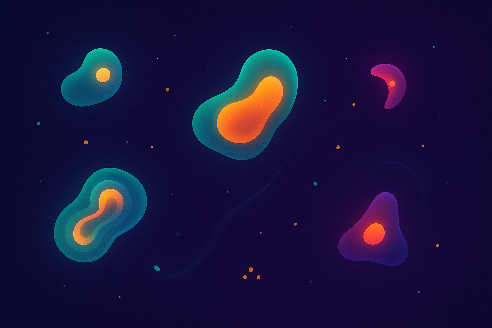

# NeuroEvoSim
Evolving artificial creatures in a simulated world

## Concept
Create a simulated ecosystem where simple agents (“creatures”) compete for resources, cooperate, or prey on each other.

Each agent has:
- A “brain” that decides how it moves and interacts
- A genome encoding its brain parameters
- Simple sensory inputs (e.g. distance to food, nearby agents, obstacles)
- A fitness function tied to survival and reproduction

## Core Mechanisms
- Use evolutionary algorithms (like NEAT or genetic algorithms) to evolve agent “brains”
- Introduce game-theoretic strategies — e.g., hawks vs doves, altruists vs defectors, predators vs prey
- Add information-theoretic constraints: creatures have limited “bandwidth” for perceiving the environment → explore how compression of information affects survival
- Include aesthetic rendering: maybe creatures are represented with generative art visuals that evolve as their genomes change

## Cool Extensions

- Let users tweak environmental parameters in real-time (temperature, resource density, mutation rates) and watch emergent behaviors
- Track species diversity, entropy, and network complexity over “evolutionary time”